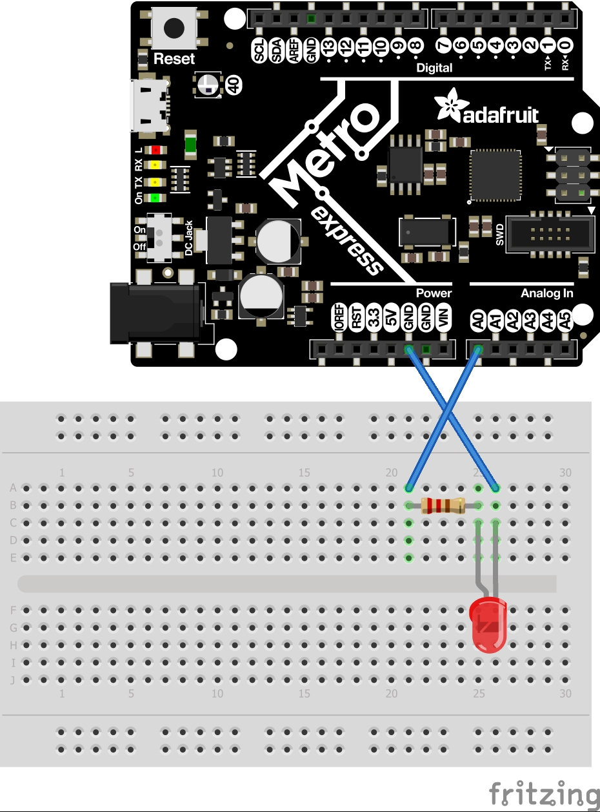
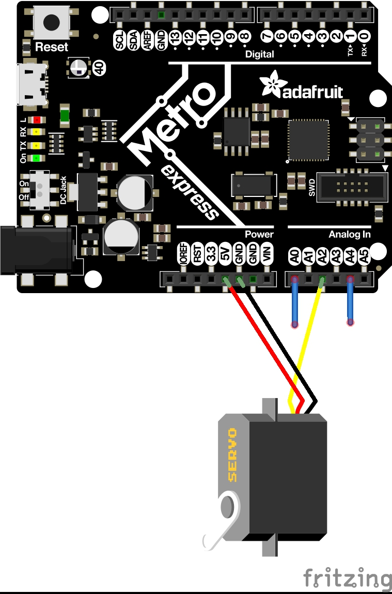
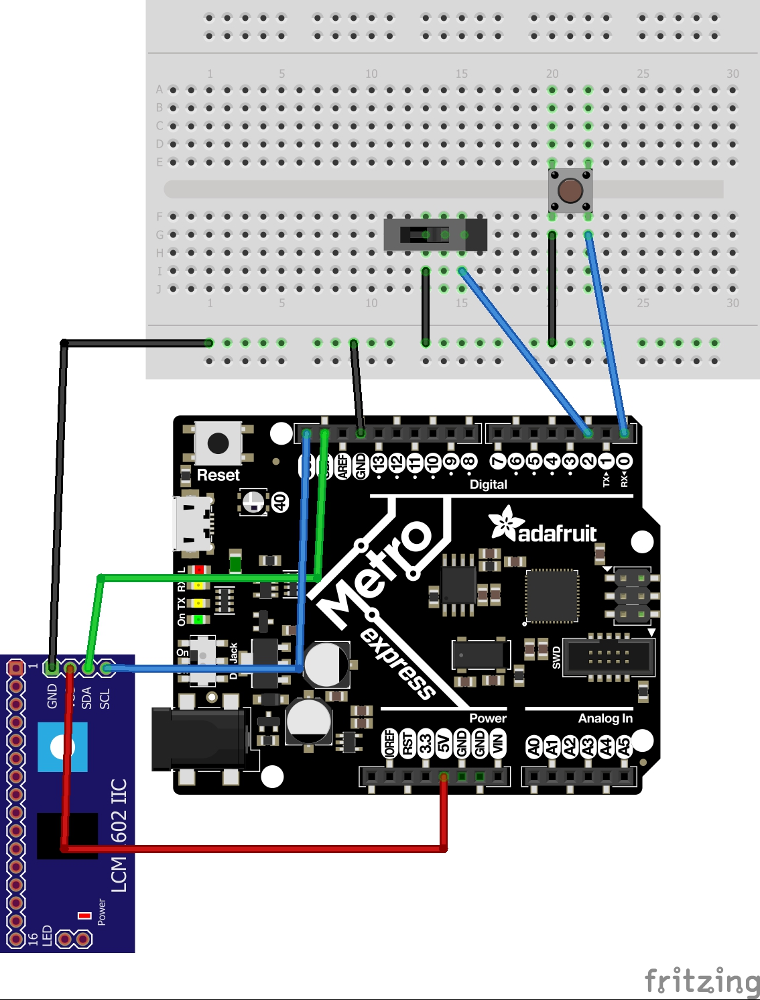
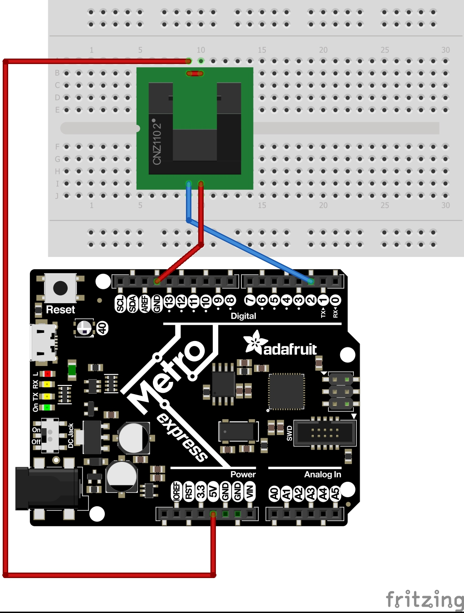
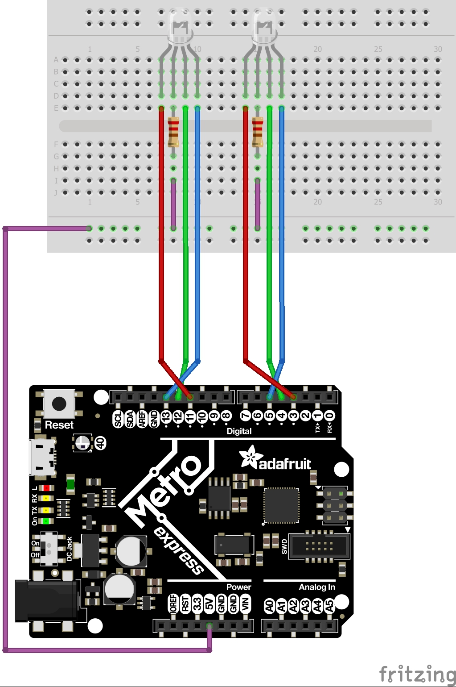
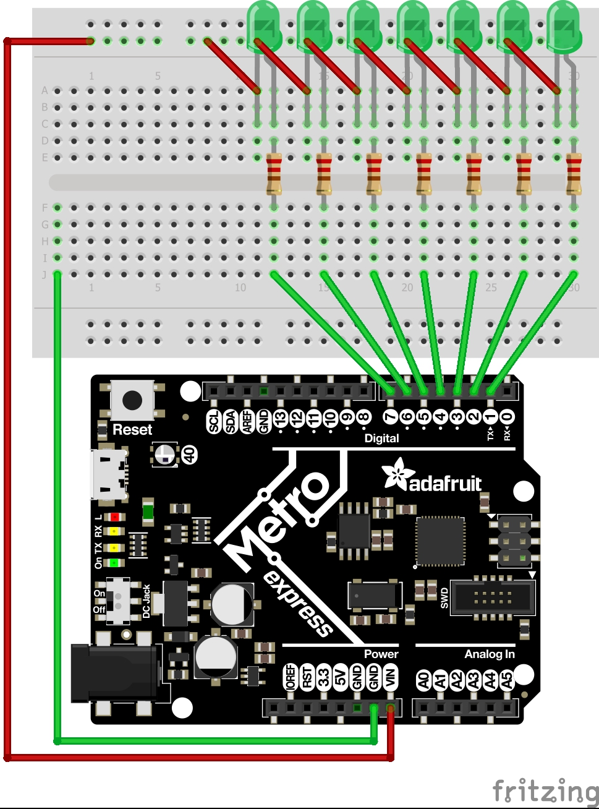

# CircuitPython
Meg CircuitPython

https://github.com/chssigma/Markdown_Cheatsheet

http://wiki.chssigma.com/index.php?title=User:Mgist56

## Hello CircuitPython
First CircuitPython assignment; making an LED fade in and out.
### Resources
https://learn.adafruit.com/series/adafruit-io-basics
### Wiring

## CircuitPython Servo
Second CircuitPython assignment; servo direction using capacitive touch.
### Resources
https://learn.adafruit.com/sensor-plotting-with-mu-and-circuitpython/capacitive-touch
https://learn.adafruit.com/adafruit-metro-m0-express-designed-for-circuitpython/circuitpython-servo
### Wiring

## CircuitPython LCD
Third CircuitPython assignment; button/switch counter on LCD.
### Resources
https://learn.adafruit.com/sensor-plotting-with-mu-and-circuitpython/buttons-and-switch
https://learn.adafruit.com/i2c-spi-lcd-backpack/python-circuitpython
https://learn.adafruit.com/circuitpython-essentials/circuitpython-digital-in-out
### Wiring

## CircuitPython Photointerrupters
Fourth CircuitPython Assignment; photointerrupter interrupt counter.
### Resources
### Wiring

## CircuitPython Distance Sensor
Fith CircuitPython assignment; NeoPixel color change with HCSRO4 sensor.
### Resources
### Wiring

## CircuitPython RGB
Sixth CircuitPython assignment; common anode RGB LED color change with RGB library.
### Resources
https://www.hackster.io/techmirtz/using-common-cathode-and-common-anode-rgb-led-with-arduino-7f3aa9
### Wiring

## CircuitPython Fancy LED
Eighth CircuitPython assignment; six LED patterns using four custom meathods.
### Resources
### Wiring

## Assignment Template

### Resources

### Wiring
